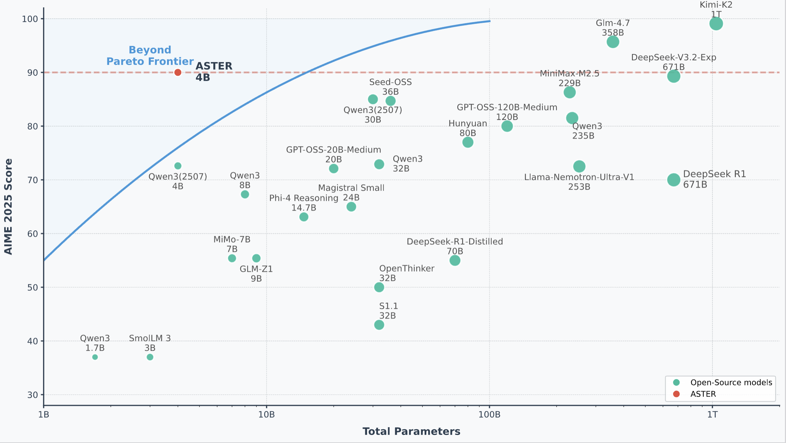

# ASTER: Agentic Scaling with Tool-integrated Extended Reasoning

<div align="center">

  <summary>
    <a href="https://arxiv.org/abs/2602.01204">
      
    </a>
    <a href="https://huggingface.co/datasets/QuantumStackOverflow/Aster_SFT4K">
      
    </a>
    <a href="https://huggingface.co/QuantumStackOverflow/ASTER_4B_RL">
      
    </a>
    <a href="https://crocus-phlox-d84.notion.site/ASTER-Agentic-Scaling-with-Tool-integrated-Extended-Reasoning-30284206990680bcb054e573c052339d">
      
    </a>
    <a href="asserts/wx.png">
      
    </a>
  </summary>


</div>

<p align="center">
  
</p>

> **⚠️ Important Notice**: This repository is a **reproduction** of the ASTER work. We follow the details described in the original paper, but **cannot guarantee complete consistency** with the original implementation.  A potentially significant difference is the training hardware/platform — we reproduce on **NVIDIA GPUs**, while the original work was trained on **Huawei Ascend 910**.

## 🔥 News

- [2026.02.13] We **open-source** our full reproduction of **ASTER**, including:
  - **Dataset**: [Aster_SFT4K](https://huggingface.co/datasets/QuantumStackOverflow/Aster_SFT4K)
  - **Model**: [ASTER_4B](https://huggingface.co/QuantumStackOverflow/ASTER_4B)
  - **Training code** for both SFT and RL stages
  - Evaluation scripts

## 🚀 Overview

ASTER (**A**gentic **S**caling with **T**ool-integrated **E**xtended **R**easoning) is a two-stage framework that combines targeted cold-start supervised fine-tuning with reinforcement learning to scale Tool-Integrated Reasoning (TIR) capabilities in Large Language Models.


### Core Problem

Traditional approaches to Tool-Integrated Reasoning often suffer from **interaction collapse** during RL training: a pathological failure mode where models fail to sustain multi-turn tool usage, instead degenerating into extensive internal reasoning followed by trivial, post-hoc code verification, rather than engaging in genuine iterative planning.

### Solution

ASTER addresses this challenge through an **interaction-dense cold-start strategy**:
- **Interaction Density**: Prioritizing long trajectories with multiple tool invocations
- **Behavioral Prior**: Establishing multi-turn tool-use behavioral patterns through cold-start SFT
- **Multi-stage RL**: Employing a two-stage curriculum learning strategy that progressively increases context length from 18K to 32K tokens

---

## ✨ Key Features

- **Two-Stage Training Pipeline**:
  - **Stage 1**: Cold-start SFT with interaction-dense trajectories (4K samples, 9+ tool-interaction turns each)
  - **Stage 2**: Multi-stage RL using Group Relative Policy Optimization (GRPO) with progressive context length scaling
- **Interaction-Dense Design**: Long trajectories with frequent tool invocations to prevent interaction collapse
- **Stateful Tool Environment**: Python sandbox that persists execution state across turns
- **Outcome-Only RL**: Binary reward based on final answer correctness, enabling efficient learning from sparse feedback

---

## 📊 Experimental Results

ASTER achieves state-of-the-art performance across competitive mathematical reasoning benchmarks:

### Main Results (ASTER-4B, 90K Inference Budget)

**Evaluation Parameters:**
- `top_p = 1.0`
- `temperature = 1.0`
- `max_assistant_turns = 256`

| Benchmark | Accuracy |
|-----------|----------|
| **AIME 2025** | **87.7%** |
| **HMMT 2025** | **77.1%** |

**Note**: The AIME 2025 generation results are available in [`asserts/aime25.jsonl`](asserts/aime25.jsonl).

Our RL experiments use [Qwen3-4B-Thinking-2507](https://huggingface.co/Qwen/Qwen3-4B-Thinking-2507) as the backbone model and [DAPO-17K](https://github.com/THUDM/DeepDive) as the training dataset. 

---

## 🔬 Reproduce the Results

### 1. Multi-Turn SFT using LlamaFactory

#### 1.1 Prepare Dataset

First, download the dataset and place it in the correct location:

```bash
# Install huggingface_hub before downloading the dataset
# pip install huggingface_hub
# Download dataset from HuggingFace
# Method 1: Using huggingface-cli (provided by huggingface_hub package)
huggingface-cli download QuantumStackOverflow/Aster_SFT4K train.parquet --repo-type dataset --local-dir llamafactory/data --local-dir-use-symlinks False
# Or you can try: 
# python -c "from huggingface_hub import snapshot_download; snapshot_download(repo_id='QuantumStackOverflow/Aster_SFT4K', repo_type='dataset', local_dir='llamafactory/data', local_dir_use_symlinks=False)"

# Method 2: Manual download and move file
# After downloading train.parquet, move it to llamafactory/data/aster_sft.parquet
mv llamafactory/data/train.parquet llamafactory/data/aster_sft.parquet
```

#### 1.2 Configure Training Parameters

Edit the `llamafactory/examples/train_full/qwen3_full_sft.yaml` file and set the following required parameters:

- `model_name_or_path`: Base model path (e.g., `Qwen/Qwen3-4B-Thinking-2507` or local path)
- `dataset_dir`: Dataset directory path (e.g., `llamafactory/data`)
- `output_dir`: Model output directory path

#### 1.3 Start Training

```bash

cd llamafactory

python -m venv llamafactory_env
source llamafactory_env/bin/activate
pip install -r requirements.txt
pip install liger-kernel tensorboard
pip install -e .

# Method 1: Override configuration via command line arguments (recommended)
bash scripts/sft_qwen3_4b.sh \
    model_name_or_path=Qwen/Qwen3-4B-Thinking-2507 \
    dataset_dir=data \
    output_dir=ckpts

# Method 2: Use default configuration (requires setting all paths in yaml file)
bash scripts/sft_qwen3_4b.sh
```

**Note**: 
- Training logs are automatically saved to `llamafactory/ckpts/train_sft_YYYYMMDD_HHMMSS.log`
- Adjust batch size via `per_device_train_batch_size` and `gradient_accumulation_steps` to fit memory constraints


### 2. Install Sandbox

> **⚠️ Important**: Our sandbox is **stateful** — it persists execution state across multiple tool invocations, which is crucial for multi-turn tool-integrated reasoning. Please follow the installation guide carefully.

See detailed installation instructions in [sandboxfusion/README.md](sandboxfusion/README.md).


### 3. RL Training

0. Install training env
```bash
conda create -n aster python=3.11.13
conda activate aster
pip install 'vllm==0.10.2'
pip install -r requirements.txt
pip install flash_attn==2.8.3 --no-build-isolation
pip install -e .
```

1. Get training and validation data
```bash
# Train 4B model for the first stage with 3 epochs
bash scripts/train/train_4b_first_stage.sh
```

2. Filter all correct data from the last epoch of the first stage
```bash
python scripts/train/filter_all_correct.py \
    --dataset ./datasets/dapo.parquet \
    --rollout-dir ./final_ckpts/Aster_4B_maxturns_50_maxresp_16384/rollout_data \
    --output ./datasets/dapo_filter_all_correct.parquet \
    --step-min 271 \
    --step-max 405 \
    --plot \
    --threads 32
```

3. Convert checkpoints
```bash
python -m verl.model_merger merge \
    --backend fsdp \
    --local_dir ./final_ckpts/Aster_4B_maxturns_50_maxresp_16384/global_step_405/actor \
    --target_dir ./final_ckpts/Aster_4B_maxturns_50_maxresp_16384/global_step_405/actor/huggingface

mv ./final_ckpts/Aster_4B_maxturns_50_maxresp_16384/global_step_405/actor/huggingface /root/ckpts/Aster_4B_maxturns_50_maxresp_16384_step405
```

4. Train the 4B model with filtered data. **Note**: Remember to update the model path to the first stage model path.
```bash
bash scripts/train/train_4b_second_stage.sh
```

---

## Starchart

<div align="center">

[](https://star-history.com/#Rainyrou/ASTER&Date)

</div>

## Acknowledgments

- Thanks to the authors of the [ASTER](https://arxiv.org/abs/2602.01204) paper for their detailed work
- Built on top of [Qwen3-4B](https://huggingface.co/Qwen/Qwen3-4B-Thinking-2507) base models
- Uses [DAPO](https://github.com/BytedTsinghua-SIA/DAPO) as the training dataset
- Uses [LlamaFactory](https://github.com/hiyouga/LlamaFactory) for multi-turn SFT
- Uses [SandboxFusion](https://github.com/bytedance/SandboxFusion) for RL training
- Uses [verl](https://github.com/verl-project/verl) framework for RL training


```
@misc{zhang2026aster,
  title        = {ASTER: Agentic Scaling with Tool-integrated Extended Reasoning},
  author       = {Zhang, Xuqin and He, Quan and Zheng, Zhenrui and Zhang, Zongzhang and He, Xu and Li, Dong},
  year         = {2026},
  eprint       = {2602.01204},
  archivePrefix= {arXiv},
  primaryClass = {cs.CL}
}
```
